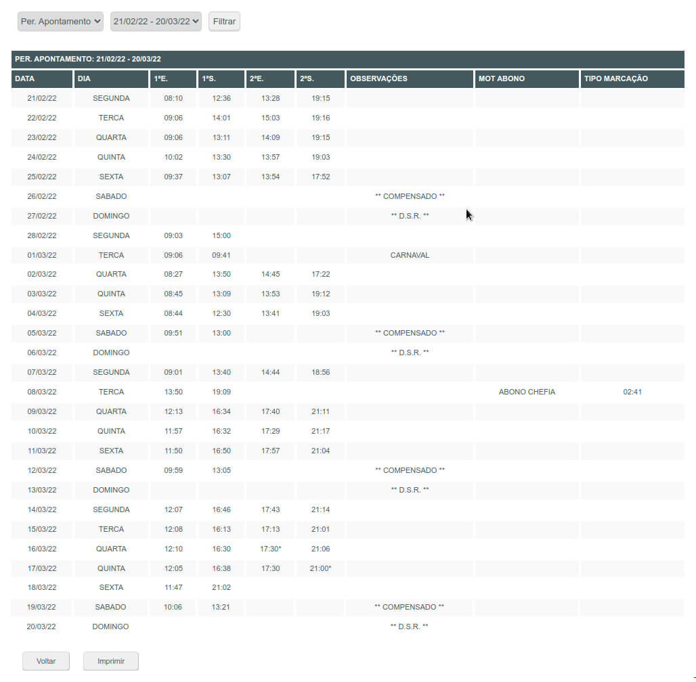
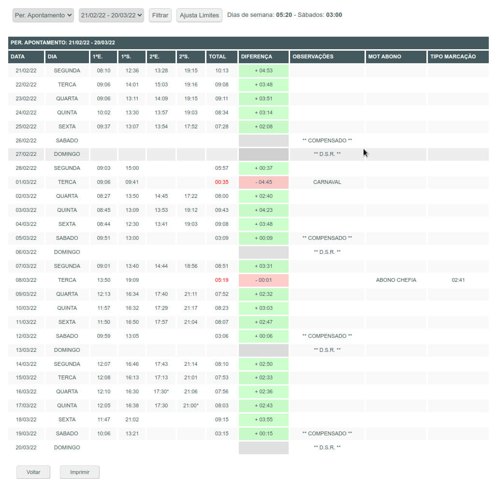

# improveProtheusTOTVS

## Problem
Check in the Protheus system ([TOTVS](https://en.totvs.com)) the monthly workload of all employees based on entries of multiple daily entries and exits in tables that do not provide a summary per day

## Challenge
Create a new column in the table with the sum of all input and output differences per line (as a bonus, leave the hours of those who worked less than 5:20 hours in red, highlight the table row under the mouse and allow the export of data in XLS format)

## Solution
Use Javascript to read, process and update the HTML of the page already loaded

## Usage
- Login to the system
- Click on "Consultas"
- Click on "Listagem de Marcações"
- In the area on the right, click on the code for which you want to see the times and wait for all the data to be loaded
- Open the "Developer tools" by pressing F12
- Select the "Console" tab
- Copy the code from the "improveProtheusTOTVS.min.js" file and paste it in the free area of the open console
- Press ENTER

## Improvements
For security reasons, the installation of extensions in the browsers used in the company is not allowed, but the code created can be easily adapted to run automatically using [Tampermonkey](https://www.google.com/search?q=Tampermonkey), [Greasemonkey](https://www.google.com/search?q=Greasemonkey) or similar

---

## Problema
Conferir no sistema Protheus ([TOTVS](https://www.totvs.com)) a carga horária mensal de todos os colaboradores baseado em lançamentos de múltiplas entradas e saídas diárias em tabelas que não fornecem a sumarização por dia

## Desafio
Criar uma nova coluna na tabela com a soma de todas as diferenças de entrada e saída por linha (como bônus deixar em vermelho o horário de quem houver trabalhado menos de 5:20 horas, realçar a linha da tabelas sob o mouse e permitir a exportação dos dados em formato XLS)

## Solução
Utilizar o Javascript para leitura, processamento e atualização do HTML da página já carregada

## Utilização
- Executar o login no sistema
- Clicar em "Consultas"
- Clicar em "Listagem de Marcações"
- Na área à direita clicar no código que se deseja ver os horários e aguardar carregar todos os dados
- Abrir as "Ferramentas do desenvolvedor" pressionando F12
- Selecionar a aba "Console"
- Copiar o código do arquivo "improveProtheusTOTVS.min.js" e colar na área livre do console aberto
- Pressionar ENTER

## Melhorias
Por questões de segurança não é permitida a instalação de extensões nos navegadores utilizados na empresa, mas o código criado pode ser facilmente adaptado para executar automaticamente utilizando [Tampermonkey](https://www.google.com/search?q=Tampermonkey), [Greasemonkey](https://www.google.com/search?q=Greasemonkey) ou similar

---

Before / Antes

After / Depois

